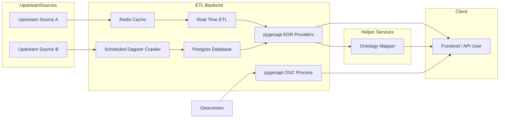

# Technical Architecture

## Backend

You can get data in 3 main ways:

1. Through direct proxies to the upstream API
   - If a source cannot be geospatially queried, we can also use Geoconnex.
     - However, it seems preferrable to limit this as much as possible since:
       1. it is harder to test as an external dependency
       2. it adds an extra layer of latency
       3. it adds another point of failure to the API
       4. we have to proxy/crawl anyways
2. Through a db populated by a crawler due to latency or other constraints
3. Specialized OGC Processes to answer questions that cannot be easily answered by EDR / OAF
   - It seems that most of the time it will be easier and more genearlizable to just fetch and join the data from the frontend
   - At the moment I don't think there are any backend endpoints which need Geoconnex, only frontend graphs (i.e. plotting HUCs, etc)

### Backend Infrastructure Diagram

In phase 2, there may be additional `Helper Services` for auth or cms functionality.

### Deployment

Start with a VM and Docker Compose; as needed, move services to Cloud Run. Realistically putting everything into Cloud Run all at once and getting the networking right may take a bit.

GKE Autopilot is another option which may make deploying the entire stack of containers easier up front, but may be more complex / expensive to maintain.
