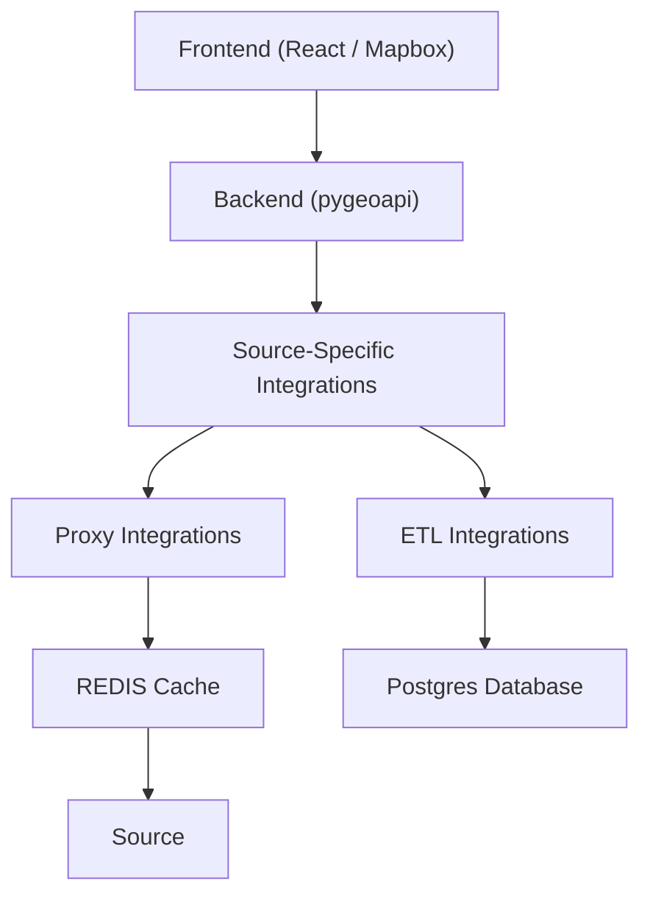

# Arizona Water Observatory

The Arizona Water Observatory is a collabortion between Arizona State University and the Lincoln Institute of Land Policy's Center for Geospatial Solutions.

This repo holds all code for the Arizona Water Observatory project including

1. The Frontend UI written with React and Mapbox
2. The backend integrations written with pygeoapi 
    - Our pygeoapi fork for this project can be found here: https://github.com/internetofwater/pygeoapi/tree/tmp-awo
3. The deployment scripts with terraform on GCP
4. Some of the ETL code is in this repository
    - Some of the more complex ETL code for Arizona Department of Water Resources groundwater wells is present here: https://github.com/cgs-earth/ArizonaGroundWaterETL/

## Running Locally

You can run the project by following the commands in the [makefile](makefile) and spinning up the necessary resources in docker compose. Then you can move into the `ui` folder and start the ui with `npm run dev`. You will need a mapbox token in your `.env` file to use the map.

## Cloud Components

The AWO uses a standard geospatial client-server architecture.

- Frontend Written in React and Mapbox
- Backend written with pygeoapi which serves an OGC API Features / OGC API EDR / OGC API Maps endpoint to the frontend
    - This is containerized and ran on Google Cloud Run in production
- There are many source-specific integrations within pygeoapi
    - Most are proxies like USACE, SNOTEL, NOAA National Water Model, and the USGS National Map.
        - We use a REDIS cache for some of the proxies to reduce latency. 
    - There are a few like Arizona Department of Water Resources Groundwater Data which are ETL'd into postgres

